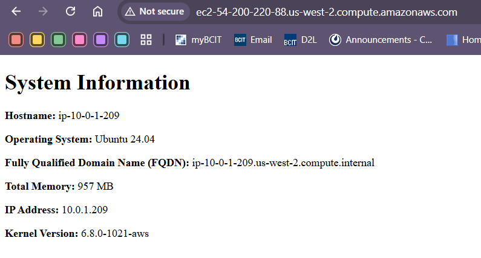

# lab-week7-ansible

# Instructions
1. Run `ssh-keygen -f aws` to create a key-pair called 'aws'
1. Run `./scripts/import_lab_key ~/.ssh/aws.pub` to import the public key to AWS 
1. Navigate to the 'terraform' directory, initialize Terraform, and run `terraform apply` to provision the lab resources
1. Modify 'playbook.yml' to have the play do tasks you want
1. Add `hosts: all` or `hosts: web` to specify which nodes to run the tasks on and `become: yes` to run commands as root (required for installing nginx)
1. Run `ansible-playbook playbook.yml` to execute the play
1. Run `terraform destroy` and `./scripts/delete_lab_key` to clean up lab resources and remove the public key from AWS

## Screenshot
